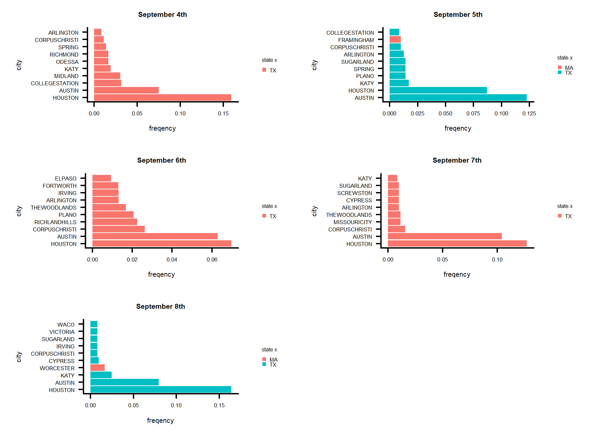
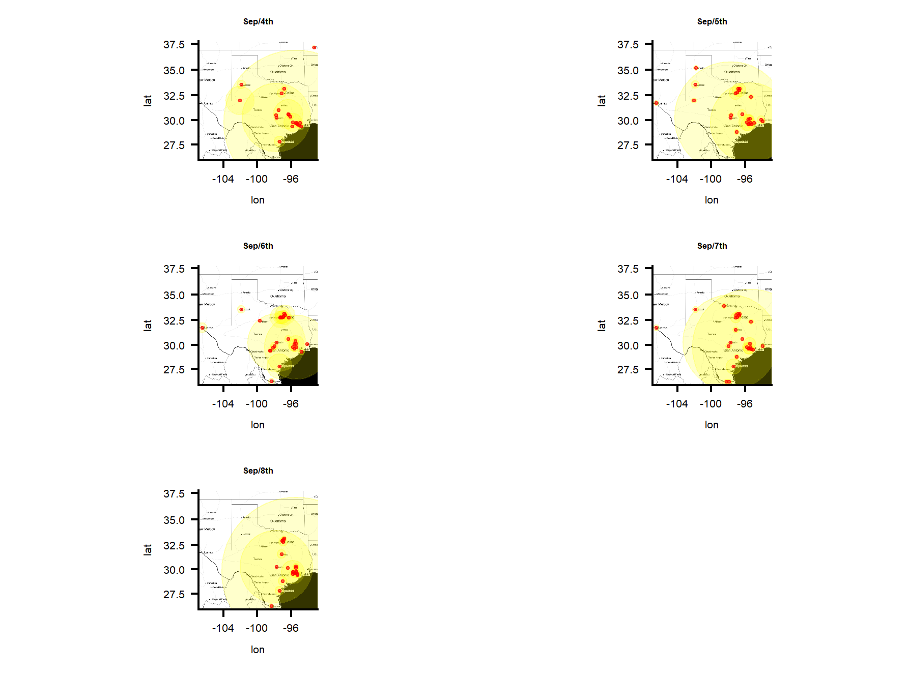

```{r setup, include=FALSE}
knitr::opts_chunk$set(echo = TRUE)
```

# 1 introduction

Hurricane Harvey is an Atlantic hurricane that has attack America for several times in the past year. The most recent attack happened on August 13 when the National Hurricane center detect the hurricane on the western east of Africa. It hit United States on Texas and Louisiana on August 23rd. 

The main purpose of this project is to use social commuication media to access some key information about his hurricane attack. I am going to use the information from twitter to identify possible the most serious hurt area and its possible moving route.


# 2 Methods:

## 2.1.	Basic assumption:
Before starting the analysis, there are few assumptions we need to check.

* __Assumption 1__  :The severity of the hurricane affects the times people tweets.
* __Assumption 2__  :The location information in the location column the tweet original display is accurate and represent the people’s real location.
* __Assumption 3__  :The missing and useless data is random. It is difficult to check this assumption, in order to do the analysis, I have to assume the assumption is right.

We will check these assumptions later in the result part to make sure this analysis is valid

## 2.2.	Data extraction:

The data comes from twitter from Sep 4th to Sep 8th by using the key word"#Hurricaneharvey"[1]. The detail information is in the part one "getting the data" in the code.rmd. For each day, I pooled the 10,000 tweets data from the API using the key word of "#HurricaneHarvey". For the date Sep 4th, I only pulled 4463 records since the overall twitter number is not enough. Then, by using the location information as the basic data source, I identify the path of hurricane and use the number of the same location occur as the severity of the hit.

Also, I poll the data again using the same method for Sep 29th. Still with the key word of "a" to aviod influence of hurricane and get the most usual pattern of usually tweets. This dataset is used as reference for correction later.

## 2.3.	Data cleaning:

The data cleaning process include several steps by using different kinds of packages[2][3][4].

* __Step1 Get rid of useless information__	  Delete the data without “location” information(NAs) and create new dataset called cHHs.[2]

* __Step2	Further cleaning the data__   This step includes separating the location information by city and state, showing all the characters in upper form and cleaning the spaces. Then, separate the dataset into two part, the one with useful state information and the one without useful state information. Abandon those without useful state information since most of it are typed and have nonsense information compared to those with state. When I doing this, the assumption is that the pattern are the same for those have state information and without state information.[3][4]

* __Step 3 Extract specific State information__	  Since the hurricane hurt TX and LA, extract the time each city shows in TX and LA. Then, separate the dataset based on different dates. Also, in order to check the assumption we listed before, we need to extract other state information, too. We choose to extract MA and NA as reference states.


## 2.4.	Data display and modeling:

I am going to display the data by using bar plot and marking them on the plot. This process contains using of several packages, including ggplot2[5],ggmap[6] and mapproj[7]. The graphing process containing several different steps.

### 2.4.1 Basic row data exploration

Graphing the first 20 cities that have the most frequency of showing for different dates using ggplot (geom_bar) and for the reference dates, too. Also, I use the cowplot package to display all the plots[8]


### 2.4.2 Exclude other confounders by using the reference data

In order to exclude other confoundings that may have effect on twitter number, I extract the twitter date at Sep 29th. Since September 29th is the date almost a month away from the hit of hurricane Harvey, we can suppose that the twitter number in that date can represent usual twitter number. 

I get the frequency of each city that shows up in the twitter for the top 40 cities each day from Sep 4th to Sep 8th and Sep 29th. And then, using the frequency in the hurricane days to subtract the frequency of none hurricane days and get the absolute differences.(since there are cities doesn't show in the reference data, we cannot use relative risk)

After we get the absolute difference, that is the one indicator I would use for the following step, including showing them on the map.

### 2.4.3 modeling the data


In order to estimate the probability of each city occurs in tweets on different dates, I use the following model to access the Outcome

$$P(Y_{i}=1)=X_{i1}\beta_{i1}+X_{i2}\beta_{i2}+X_{i3}\beta_{i3}+X_{i4}\beta_{i4}+X_{i5}\beta_{i5}+X_{i6}\beta_{i6} $$

Xs are all binary varibles(0/1) indicating different dates in the data set. By doing this, I treated the dates as categorical varible and write them up in the dummy form. Yis are the cities that shows up in the data, each city represent a different Y. The model is using the analysis the probability of each city shows up in different dates. Thus, the coeffcient would be the probability of each city shows.


### 2.4.4	Using ggmap package and ggplot to graph the area on the map as to visualize the data.

In this step, by using the ggmap and ggplot2 package, and the aboslute differences as indicator, I draw a map showing the abolute frequency about each city on the map to indicate the severity of the hit by the hurricane.

## 2.5.	Assumption checking


In order to check the assumptions, I use the below steps to do the checking.

* __Assumption 1__  	By comparing the frequency of Maryland cities showed up and TX/LA cities showed up. Test the hypothesis of whether most hit area got the most tweets number.
* __Assumption 2__    By comparing the frequency of hurricane dates and non-hurricane dates. Both assumption1 and assumption2 are done by the adjusting. If after adjusting, there are more TX/LA cities shows up than before adjusting, it would support the assumption

# 3. result:

## 3.1 Most seriesly hurt area:

Before the adjusting, we can see that there are several non-hurricane hit state are in the top 20 cities that have the most tweets, but most of them are from hurricane hit area. The cities that are in the top 20 all the five days(form sep 4th to sep 8th)($\beta \neq 0$) are Houston, Austin, Dallas, Lasvegas, Boston, Sanantonio, Fortworth, Corpuschristi, Neworleans. The 9 cities listed above, besides Las vegas and boston, other cities are from state of TX and LA. Since the coefficents are probabilities, they are showing as frequency in the citys_9_i datasets. I choose the top 20 cities based on the frequencies.

After adjusting, the cities that are in the top 20 all the five days(from sep 4th to sep 8th) are Houston, Austin, Katy, Corpuschristi, Arlington, and all the cities are from texas. This result check the assumption 1 and 2, showing that there is an inference of hurricane in the tweets number.
The top 10 cities in different dates after adjusting are visulized as figure1.




##  3.2.	Possible route of Hurricane moving:

From figure2, Huston always the biggest proportion in the map. This is reasonable since Boston is the capital of the TX. It is difficult to tell whether Huston is the most hit city. However, as the time passed on, the trend are moving to the northwest of the state and then get back. This may show the pattern as the hurricane moves into the mainland.




#  4. Conclusion.

In this project, I predict the most hurt area by counting the number of tweets sending from each city. From the result, Huston and Austin get the most frequency of showing up and this is the same as what I found from the actual damage information from the internet. However, there are few limitations about this analysis.

As for the result, although that the results are most similar to the actual serious hurt area, there is an exception. Dallas, which is also serious hurt, not shown itself in the map. In order to make sure why this happen, I check again the original dataset before the adjustment, and there it is, always in the best 10 of the city list. So, what might happened is, it shows up in high frequency on date 9/29, too. And after the subtraction, it disappear. This might happen by on the specific day of 9/29, people in Dallas accidently tweet a lot by some reason.
However, by using the twitter, it can give a basic map of what is happening across the country, but not that precisely. 


#  5. Citations:

1.  Jeff Gentry (NA). twitteR: R Based Twitter Client. R package version 1.1.9.
   http://lists.hexdump.org/listinfo.cgi/twitter-users-hexdump.org


2.  Hadley Wickham, Romain Francois, Lionel Henry and Kirill Müller (2017). dplyr: A Grammar of Data Manipulation. R
  package version 0.7.4. https://CRAN.R-project.org/package=dplyr
  
3.  Hadley Wickham and Lionel Henry (2017). tidyr: Easily Tidy Data with 'spread()' and 'gather()' Functions. R package
  version 0.7.0. https://CRAN.R-project.org/package=tidyr
  
4.  Hadley Wickham (2017). stringr: Simple, Consistent Wrappers for Common String Operations. R package version 1.2.0.
  https://CRAN.R-project.org/package=stringr 

5.  H. Wickham. ggplot2: Elegant Graphics for Data Analysis. Springer-Verlag New York, 2009.

6.  D. Kahle and H. Wickham. ggmap: Spatial Visualization with ggplot2. The R Journal, 5(1), 144-161. URL
  http://journal.r-project.org/archive/2013-1/kahle-wickham.pdf

7.  Doug McIlroy. Packaged for R by Ray Brownrigg, Thomas P Minka and transition to Plan 9 codebase by Roger Bivand.
  (2017). mapproj: Map Projections. R package version 1.2-5. https://CRAN.R-project.org/package=mapproj
  
8. Claus O. Wilke (2017). cowplot: Streamlined Plot Theme and Plot Annotations for 'ggplot2'. R
  package version 0.8.0. https://CRAN.R-project.org/package=cowplot


